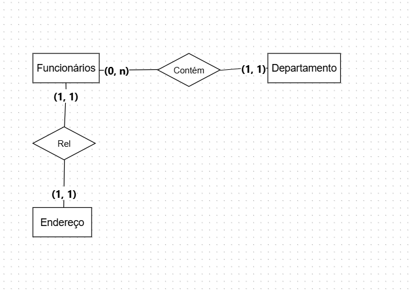
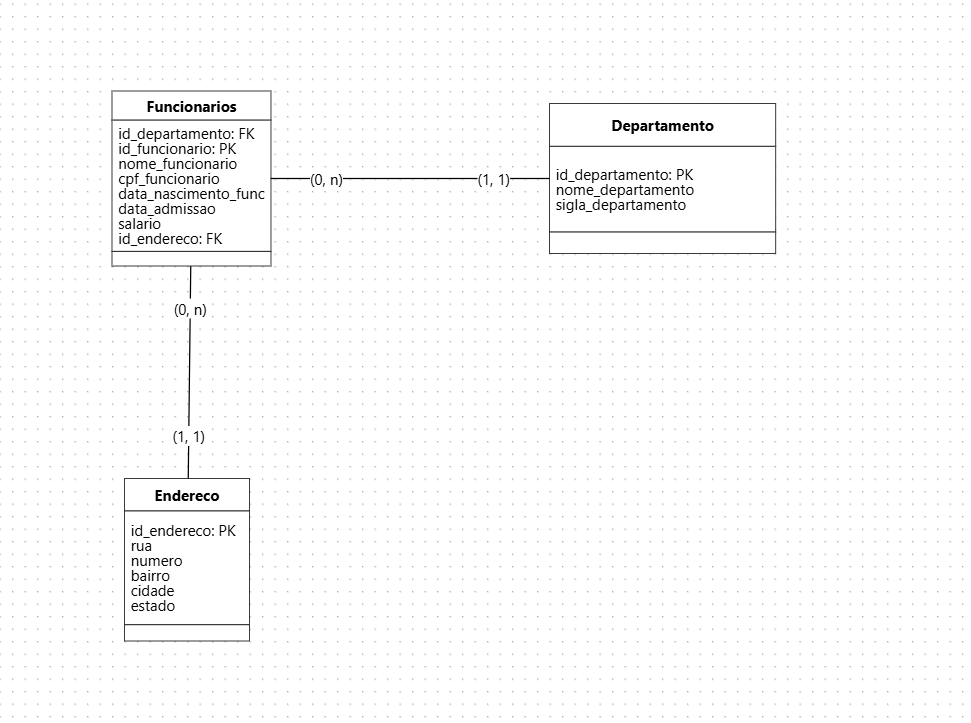

# 🏢 Minicenário 01: Gestão de Recursos Humanos (XPTO)

### 📝 O Cenário
A microempresa **XPTO** buscou a informatização de seu departamento de Recursos Humanos. O objetivo principal desta solução é centralizar o cadastro de colaboradores vinculados ao regime CLT e organizá-los por departamentos, garantindo a integridade dos dados cadastrais e geográficos.

### 🎯 Foco do Projeto
Esta é uma versão inicial (MVP) focada em:
* **Estrutura Organizacional:** Relacionamento entre colaboradores e setores.
* **Gestão de Endereços:** Normalização da localização para evitar redundância.
* **Dados Cadastrais:** Registro de documentos obrigatórios (CPF) e informações contratuais (Salário e Admissão).
* *Nota: Rotinas de folha de pagamento não estão inclusas nesta etapa.*

---

## 🎨 Modelo Conceitual
A primeira etapa focou em identificar as entidades principais e suas regras de negócio. Destaca-se o relacionamento **1:N** entre Departamento e Funcionário, e o relacionamento **1:1** com a entidade Endereço para uma melhor organização dos dados.

## 📐 Modelo Lógico
Na tradução para o modelo lógico, foram definidos os tipos de dados e as Chaves Estrangeiras (FK) que garantem a integridade referencial. A tabela de funcionários atua como o elo central, conectando departamentos e endereços.

---

## 🛠️ Tecnologias e Conceitos Aplicados
* **PostgreSQL:** Banco de dados utilizado para a implementação física.
* **Normalização:** Separação de dados geográficos para melhor manutenção.
* **Integridade Referencial:** Uso de `PRIMARY KEY` e `FOREIGN KEY`.
* **Restrições (Constraints):** Aplicação de `UNIQUE` para CPFs e `NOT NULL` para campos obrigatórios.

---
## 💻 Como executar o projeto
1. O script SQL de criação das tabelas está disponível no arquivo [script_xpto.sql](./script_xpto.sql).
2. Recomenda-se a execução em ambiente PostgreSQL.
