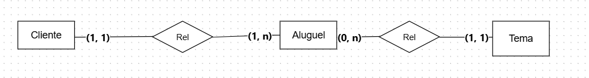
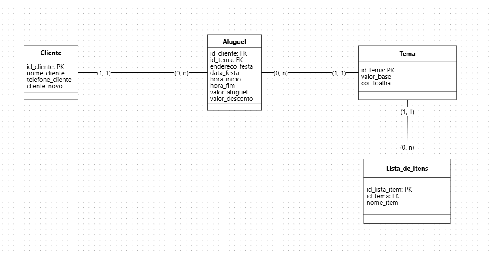

# 🎈 Minicenário 02: Aluguel de Festas Infantis (Rafaela)

### 📝 O Cenário
Rafaela trabalha com locação de temas para festas infantis e precisava de um sistema para gerenciar seus clientes, os itens de cada tema e o controle financeiro dos aluguéis (incluindo descontos para clientes antigos).

### 💡 Destaques da Modelagem
* **Flexibilidade de Preços:** O sistema armazena o valor base do tema, mas permite registrar o valor final cobrado no aluguel, suportando descontos personalizados.
* **Gestão de Itens:** Cada tema possui uma lista detalhada de componentes (ex: bonecas, castelos, acessórios).
* **Controle de Agenda:** Registro preciso de data, hora de início e término das festas.

### 🎨 Modelo Conceitual

### 📐 Modelo Lógico

---
*Projeto focado em relacionamentos entre entidades e regras de negócio financeiras.*
---
## 🛠️ Tecnologias e Conceitos Aplicados
* **PostgreSQL:** Banco de dados utilizado para a implementação física.
* **Normalização:** Separação de dados geográficos para melhor manutenção.
* **Integridade Referencial:** Uso de `PRIMARY KEY` e `FOREIGN KEY`.
* **Restrições (Constraints):** Aplicação de `UNIQUE` para identificadores e `NOT NULL` para campos obrigatórios.

## 💻 Como executar o projeto
1. O script SQL de criação das tabelas está disponível no arquivo [script_festas.sql](./script_festas.sql).
2. Recomenda-se a execução em ambiente PostgreSQL.
