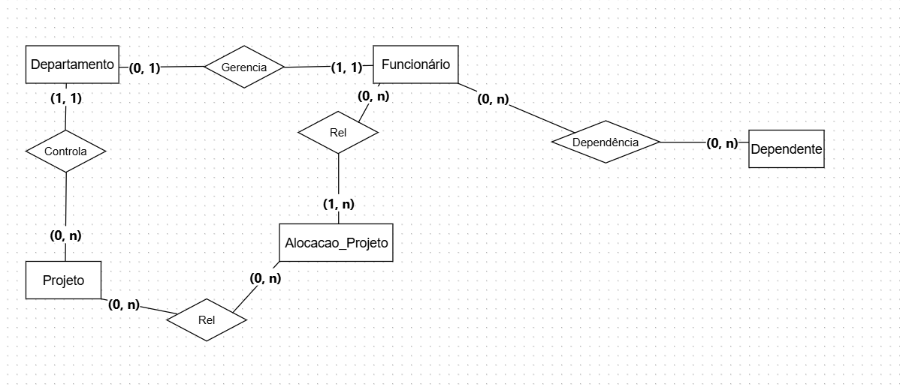
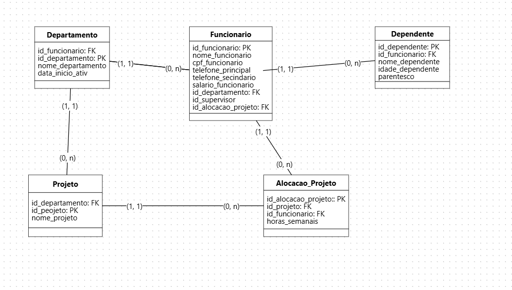

# 🏢 Minicenário 03: Gestão Corporativa e Projetos

### 📝 O Cenário
Este projeto modela a estrutura complexa de uma empresa, focando na hierarquia de gerência, supervisão direta entre funcionários, alocação em múltiplos projetos com controle de carga horária e gestão de dependentes para benefícios.

### 💡 Complexidades Resolvidas
* **Autorrelacionamento:** Implementação de hierarquia onde um funcionário supervisiona outros.
* **Entidade Associativa:** Controle preciso de horas semanais em projetos através de uma tabela de ligação (N:N).
* **Integridade de Gerência:** Registro de data de início de gerência vinculada ao departamento.
* **Dados Pessoais:** Estruturação de dependentes e múltiplos contatos telefônicos.

### 🎨 Modelo Conceitual

### 📐 Modelo Lógico

---

## 🛠️ Tecnologias e Conceitos Aplicados
* **PostgreSQL:** Banco de dados utilizado para a implementação física.
* **Normalização:** Separação de dados geográficos e dependentes para melhor manutenção.
* **Integridade Referencial:** Uso de `PRIMARY KEY` e `FOREIGN KEY` (incluindo autorrelacionamento).
* **Restrições (Constraints):** Aplicação de `UNIQUE` para CPFs e `NOT NULL` para campos obrigatórios.

## 💻 Como executar o projeto
1. O script SQL de criação das tabelas está disponível no arquivo [script_empresa.sql](./script_empresa.sql).
2. Recomenda-se a execução em ambiente PostgreSQL.

